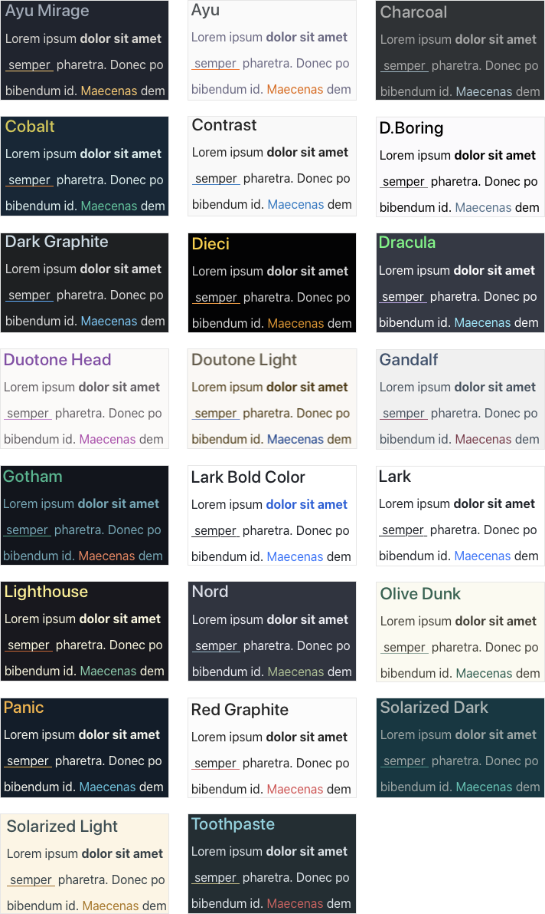

# Typora Bear Theme
一系列 [Bear](https://bear.app/) 风格的 typora 主题，共计 20 余款。
> A collection of typora themes, inspired by [Bear](https://bear.app/).

**预览 / Preview：**

**使用方法：**
1. 下载 [release](https://github.com/imageslr/typora-theme-bear/releases) 页面最新的主题压缩包 `typora-theme-bear.zip`
2. 打开 Typora 偏好设置 - 外观 - 打开主题文件夹
3. 将解压后的主题文件（.css 文件）拖到文件夹里
4. 重启 Typora
5. 点击菜单栏 - 主题，可以看到所有主题列表
6. 选择喜欢的主题

> **Usage:**
> 1. Download the latest release `typora-theme-bear.zip` from [release](https://github.com/imageslr/typora-theme-bear/releases) page.
> 2. Open Typora's "Preference - Appearance - Open Theme Folder".
> 3. Unzip the `typora-theme-bear.zip` file and drag all `.css` file into the folder.
> 4. Reload Typora.
> 5. Click "Themes" on the menu, and choose a theme you like.

**注意**：此仓库会自动从 [imageslr/mweb-themes](https://github.com/imageslr/mweb-themes) 构建并发布主题。如果您对主题的源代码感兴趣，请查看 [imageslr/mweb-themes](https://github.com/imageslr/mweb-themes)。
> **Notice**: This repo will automatically build and release from [imageslr/mweb-themes](https://github.com/imageslr/mweb-themes). If you are interested to the source code, please see [imageslr/mweb-themes](https://github.com/imageslr/mweb-themes).